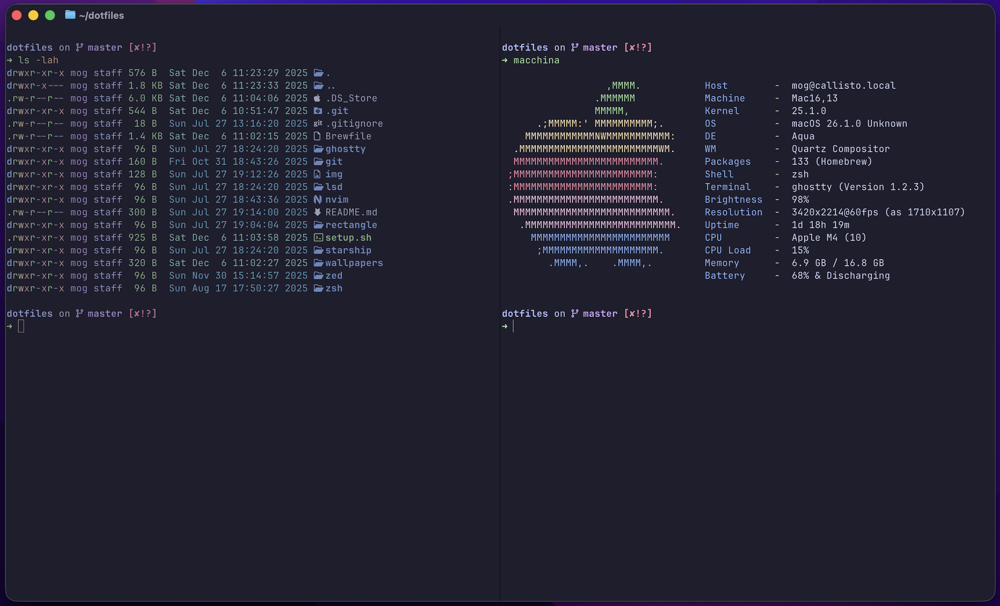

# 🤖 dotfiles

## Dependencies

```bash
$ xcode-select --install
$ /bin/bash -c "$(curl -fsSL https://raw.githubusercontent.com/Homebrew/install/HEAD/install.sh)"
$ eval "$(/opt/homebrew/bin/brew shellenv)"
$ brew install mise
```

## Bootstrap

```bash
$ git clone --branch main https://github.com/mogopz/dotfiles.git ~/dotfiles
$ cd ~/dotfiles
$ mise trust
$ mise bootstrap --yes --force-dotfiles --skip packages,tools,task
$ mise bootstrap --yes
```

## Screenshot


