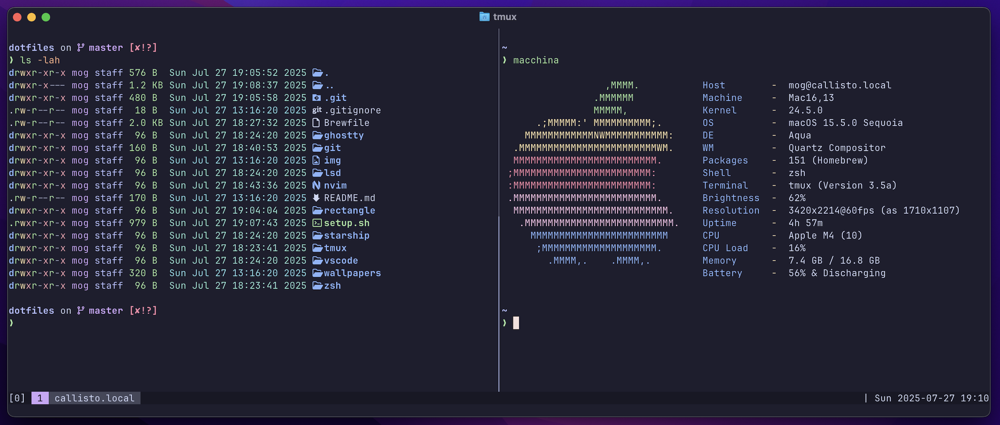

# 🤖 dotfiles

## Manual installs

There's a few tools that aren't available in Homebrew so they need to be manually installed:

- [Oh My Zsh](https://github.com/ohmyzsh/ohmyzsh)
- [SpaceVim](https://github.com/SpaceVim/SpaceVim)
- [TPM](https://github.com/tmux-plugins/tpm)

```bash
$ brew bundle
$ chezmoi init --apply mogopz
```

## Screenshot


